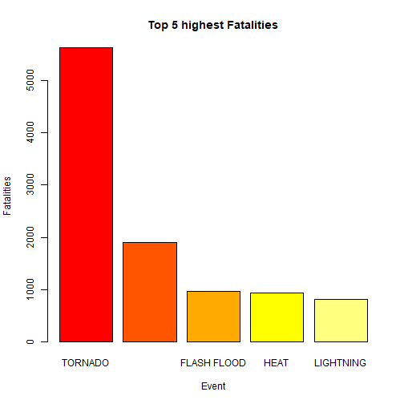
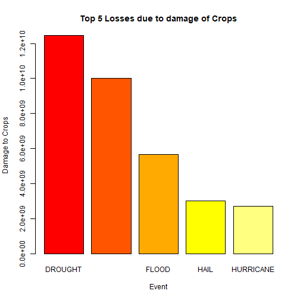
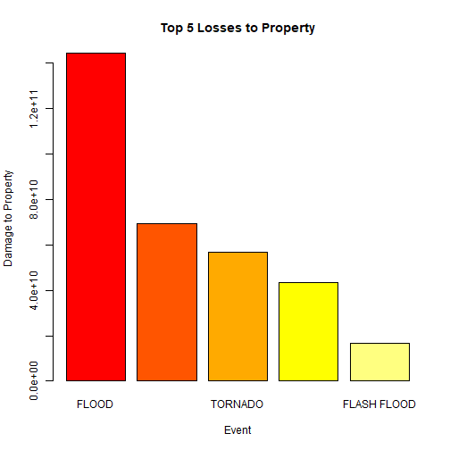

# Analyzing NOAA Storm Database to find Events causing maximum damage.

## Synopsis

The follwing analysis of the NOAA Storm Data tries to find the events that cause maximum damage with respect to health and economics. The number of Injuries caused as a result of an event has been ignored as the fatalities has been given more weightage for analysis on health. The analysis shows that Tornados are the most harmful when it comes to health. Analysis of economics is divided into 2 parts: The amount of crops damaged, and the losses resulting from damage in property. It has been found that Draught causes the maximum loss when it comes to crops, while floods cause the maximum damage when it comes to Property.

<br/>

## Data Processing

#### Downloading and Reading the Data into file


```r
data <- read.csv("Storm Data.csv")
str(data)
```

```
## 'data.frame':	902297 obs. of  37 variables:
##  $ STATE__   : num  1 1 1 1 1 1 1 1 1 1 ...
##  $ BGN_DATE  : Factor w/ 16335 levels "1/1/1966 0:00:00",..: 6523 6523 4242 11116 2224 2224 2260 383 3980 3980 ...
##  $ BGN_TIME  : Factor w/ 3608 levels "00:00:00 AM",..: 272 287 2705 1683 2584 3186 242 1683 3186 3186 ...
##  $ TIME_ZONE : Factor w/ 22 levels "ADT","AKS","AST",..: 7 7 7 7 7 7 7 7 7 7 ...
##  $ COUNTY    : num  97 3 57 89 43 77 9 123 125 57 ...
##  $ COUNTYNAME: Factor w/ 29601 levels "","5NM E OF MACKINAC BRIDGE TO PRESQUE ISLE LT MI",..: 13513 1873 4598 10592 4372 10094 1973 23873 24418 4598 ...
##  $ STATE     : Factor w/ 72 levels "AK","AL","AM",..: 2 2 2 2 2 2 2 2 2 2 ...
##  $ EVTYPE    : Factor w/ 985 levels "   HIGH SURF ADVISORY",..: 834 834 834 834 834 834 834 834 834 834 ...
##  $ BGN_RANGE : num  0 0 0 0 0 0 0 0 0 0 ...
##  $ BGN_AZI   : Factor w/ 35 levels "","  N"," NW",..: 1 1 1 1 1 1 1 1 1 1 ...
##  $ BGN_LOCATI: Factor w/ 54429 levels "","- 1 N Albion",..: 1 1 1 1 1 1 1 1 1 1 ...
##  $ END_DATE  : Factor w/ 6663 levels "","1/1/1993 0:00:00",..: 1 1 1 1 1 1 1 1 1 1 ...
##  $ END_TIME  : Factor w/ 3647 levels ""," 0900CST",..: 1 1 1 1 1 1 1 1 1 1 ...
##  $ COUNTY_END: num  0 0 0 0 0 0 0 0 0 0 ...
##  $ COUNTYENDN: logi  NA NA NA NA NA NA ...
##  $ END_RANGE : num  0 0 0 0 0 0 0 0 0 0 ...
##  $ END_AZI   : Factor w/ 24 levels "","E","ENE","ESE",..: 1 1 1 1 1 1 1 1 1 1 ...
##  $ END_LOCATI: Factor w/ 34506 levels "","- .5 NNW",..: 1 1 1 1 1 1 1 1 1 1 ...
##  $ LENGTH    : num  14 2 0.1 0 0 1.5 1.5 0 3.3 2.3 ...
##  $ WIDTH     : num  100 150 123 100 150 177 33 33 100 100 ...
##  $ F         : int  3 2 2 2 2 2 2 1 3 3 ...
##  $ MAG       : num  0 0 0 0 0 0 0 0 0 0 ...
##  $ FATALITIES: num  0 0 0 0 0 0 0 0 1 0 ...
##  $ INJURIES  : num  15 0 2 2 2 6 1 0 14 0 ...
##  $ PROPDMG   : num  25 2.5 25 2.5 2.5 2.5 2.5 2.5 25 25 ...
##  $ PROPDMGEXP: Factor w/ 19 levels "","-","?","+",..: 17 17 17 17 17 17 17 17 17 17 ...
##  $ CROPDMG   : num  0 0 0 0 0 0 0 0 0 0 ...
##  $ CROPDMGEXP: Factor w/ 9 levels "","?","0","2",..: 1 1 1 1 1 1 1 1 1 1 ...
##  $ WFO       : Factor w/ 542 levels ""," CI","$AC",..: 1 1 1 1 1 1 1 1 1 1 ...
##  $ STATEOFFIC: Factor w/ 250 levels "","ALABAMA, Central",..: 1 1 1 1 1 1 1 1 1 1 ...
##  $ ZONENAMES : Factor w/ 25112 levels "","                                                                                                               "| __truncated__,..: 1 1 1 1 1 1 1 1 1 1 ...
##  $ LATITUDE  : num  3040 3042 3340 3458 3412 ...
##  $ LONGITUDE : num  8812 8755 8742 8626 8642 ...
##  $ LATITUDE_E: num  3051 0 0 0 0 ...
##  $ LONGITUDE_: num  8806 0 0 0 0 ...
##  $ REMARKS   : Factor w/ 436774 levels "","-2 at Deer Park\n",..: 1 1 1 1 1 1 1 1 1 1 ...
##  $ REFNUM    : num  1 2 3 4 5 6 7 8 9 10 ...
```

<br/>

#### We need only a part of the Data for this particular analysis


```r
data <- data[,c("EVTYPE","FATALITIES","CROPDMG","CROPDMGEXP","PROPDMG","PROPDMGEXP")]
```

<br/>

#### Finding the total number of recored health hazards(In terms of Fatalities)
Note: Injuries are Number of ignored as the number of Fatalities is a much better parameter to define health related hazards.


```r
fatalSum <- aggregate(FATALITIES~EVTYPE,data = data,FUN = sum,na.rm = TRUE)
## Stores the total number of fatalities reported
```

<br/>

#### Now, finding the amount of economic damage by finding the damage to crops and property


```r
## Damage to property caused
data$PROPEXP[data$PROPDMGEXP == "+"     ]   <-  0
data$PROPEXP[data$PROPDMGEXP == "0"     ]   <-  1
data$PROPEXP[data$PROPDMGEXP == "5"     ]   <-  10^5
data$PROPEXP[data$PROPDMGEXP == "6"     ]   <-  10^6
data$PROPEXP[data$PROPDMGEXP == "?"     ]   <-  0
data$PROPEXP[data$PROPDMGEXP == "4"     ]   <-  10000
data$PROPEXP[data$PROPDMGEXP == "2"     ]   <-  100
data$PROPEXP[data$PROPDMGEXP ==  "K"   ]  <-    1000
data$PROPEXP[data$PROPDMGEXP == "M"     ]   <-  10^6
data$PROPEXP[data$PROPDMGEXP == ""      ]   <-  1
data$PROPEXP[data$PROPDMGEXP == "B"     ]   <-  10^9
data$PROPEXP[data$PROPDMGEXP == "m"     ]   <-  10^6
data$PROPEXP[data$PROPDMGEXP == "3"     ]   <-  1000
data$PROPEXP[data$PROPDMGEXP == "h"     ]   <-  100
data$PROPEXP[data$PROPDMGEXP == "7"     ]   <-  10^7
data$PROPEXP[data$PROPDMGEXP == "H"     ]   <-  100
data$PROPEXP[data$PROPDMGEXP == "-"     ]   <-  0
data$PROPEXP[data$PROPDMGEXP == "1"     ]   <-  10
data$PROPEXP[data$PROPDMGEXP == "8" ]   <-  10^8

data$PROPDMG <- data$PROPDMG * data$PROPEXP

propSum <- cropSum <- aggregate(PROPDMG~EVTYPE,data = data,FUN = sum, na.rm = TRUE)
## Stores the total damage to property

## Standardizing Damage to crops
data$CROPEXP[data$CROPDMGEXP == "?"     ]   <-  0
data$CROPEXP[data$CROPDMGEXP == "0"     ]   <-  1
data$CROPEXP[data$CROPDMGEXP ==  ""     ]   <-  1
data$CROPEXP[data$CROPDMGEXP == "k"     ]   <-  1000
data$CROPEXP[data$CROPDMGEXP == "2" ]   <-  100
data$CROPEXP[data$CROPDMGEXP == "M"     ]   <-  10^6
data$CROPEXP[data$CROPDMGEXP == "K"     ]   <-  1000
data$CROPEXP[data$CROPDMGEXP == "m"     ]   <-  10^9
data$CROPEXP[data$CROPDMGEXP == "B"     ]   <-  10^6

data$CROPDMG <- data$CROPDMG * data$CROPEXP

cropSum <- aggregate(CROPDMG~EVTYPE,data = data,FUN = sum, na.rm = TRUE)
## Stores the total damage to crops
```


<br/>

## Results

#### Analyzing the types of events are most harmful to population health. 


```r
##Soring fatalSum
fatalSum<-fatalSum[order(x = fatalSum$FATALITIES,decreasing = TRUE),]

##Plotting the top 5 #Fatalities alongside the Event. 
barplot(fatalSum$FATALITIES[1:5],names.arg = fatalSum$EVTYPE[1:5],ylab = "Fatalities",xlab = "Event",main = "Top 5 highest Fatalities",col = heat.colors(5))
```




### Thus, we see that Tornados are  most harmful to population health.

<br/>

#### Analyzing the types of events have the greatest economic consequences.
#### This includes loss to property and crops  

####Dealing with Crops First,


```r
cropSum<-cropSum[order(x = cropSum$CROPDMG,decreasing = TRUE),]

##Plotting the top 5 #Fatalities alongside the Event. 
barplot(cropSum$CROPDMG[1:5],names.arg = cropSum$EVTYPE[1:5],ylab = "Damage to Crops",xlab = "Event",main = "Top 5 Losses due to damage of Crops",col = heat.colors(5))
```




### Thus, we see that the highest loss to Crops is caused by Drought  

<br/>

####Next, dealing with Property


```r
propSum<-propSum[order(x = propSum$PROPDMG,decreasing = TRUE),]

##Plotting the top 5 #Fatalities alongside the Event. 
barplot(propSum$PROPDMG[1:5],names.arg = propSum$EVTYPE[1:5],ylab = "Damage to Property",xlab = "Event",main = "Top 5 Losses to Property",col = heat.colors(5))
```


<br/>

### Thus we see that highest loss to Property is caused by Flood
